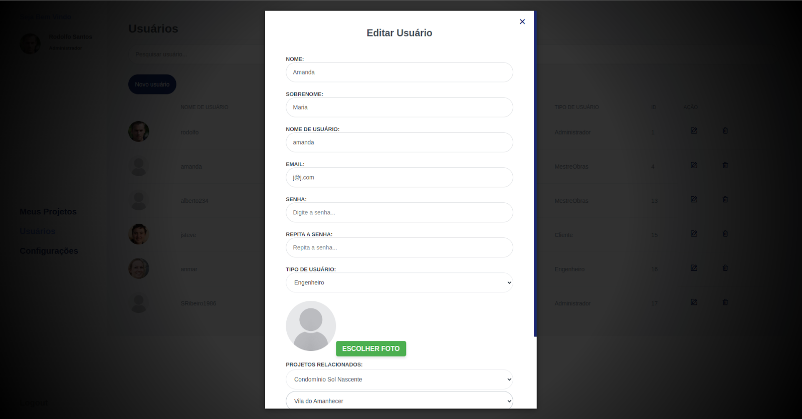

# ObraManager

### English:

## Project Description
**ObraManager** is a web application designed to optimize construction project management. The platform offers functionalities such as project tracking, user management, and financial monitoring.

## Prerequisites
Before starting the installation and execution, make sure you have the following tools and technologies installed:

- **Node.js**: Required for Vue.js.
- **Python**: Essential for the backend.
- **MySQL**: Used as the database.

### Backend Setup
1. Install Python dependencies using `pipenv install`.
2. Activate the virtual environment with `pipenv shell`.
3. Install the necessary modules.
4. Run migrations with `python manage.py migrate`.
5. Create a new user with `python manage.py createsuperuser`.
6. Start the backend server with `python manage.py runserver`.

### Frontend Setup
1. Navigate to the frontend folder.
2. Install dependencies with `yarn install`.
3. Run the project with `yarn dev`.

### Português:

## Descrição do Projeto
O **ObraManager** é uma aplicação web criada para otimizar a gestão de obras na construção civil. A plataforma oferece funcionalidades como acompanhamento de projetos, gerenciamento de usuários e acompanhamento financeiro. 

## Pré-Requisitos
Antes de iniciar a instalação e execução, certifique-se de ter as seguintes ferramentas e tecnologias instaladas:

- **Node.js**: Necessário para o Vue.js.
- **Python**: Essencial para o back-end.
- **MySQL**: Utilizado como banco de dados.

### Configuração do Backend
1. Instale as dependências do Python usando `pipenv install`.
2. Ative o ambiente virtual com `pipenv shell`.
3. Instale os módulos necessários.
4. Execute as migrações com `python manage.py migrate`.
5. Crie um novo usuario com `python manage.py createsuperuser`.
6. Inicie o servidor back-end com `python manage.py runserver`.

### Configuração do Frontend
1. Navegue até a pasta do frontend.
2. Instale as dependências com `yarn install`.
3. Execute o projeto com `yarn dev`.

# Screenshots:

